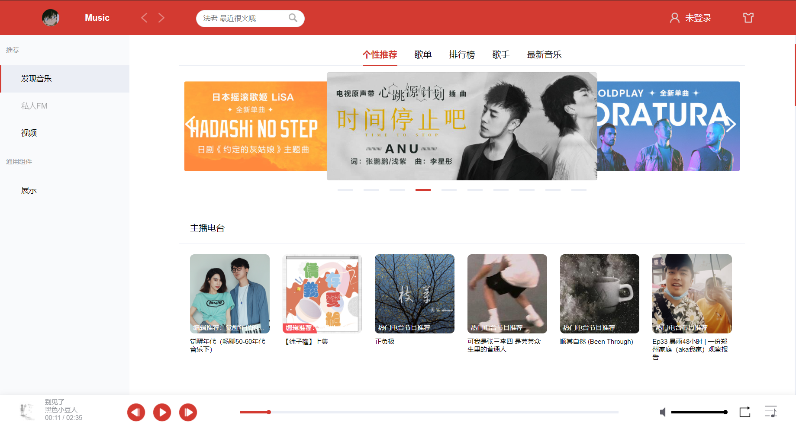
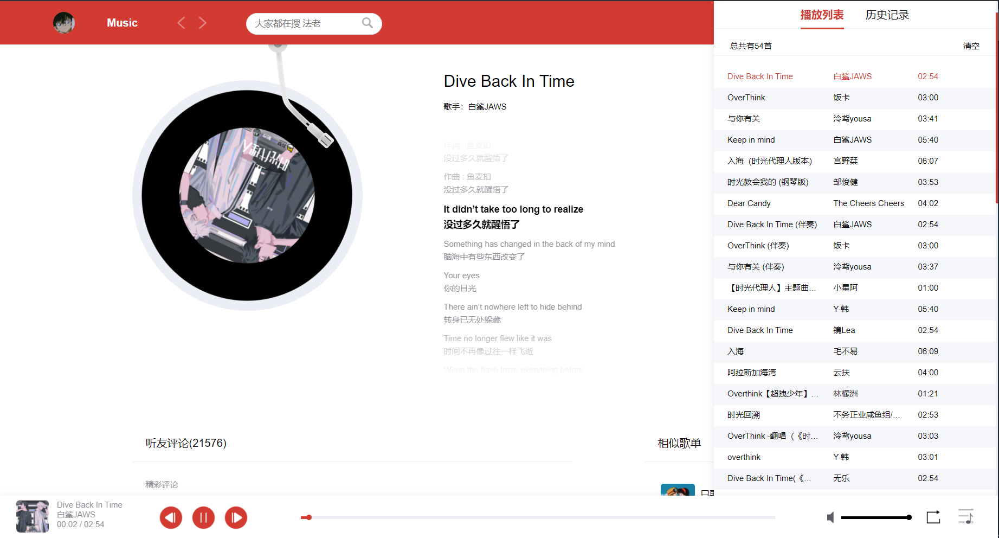
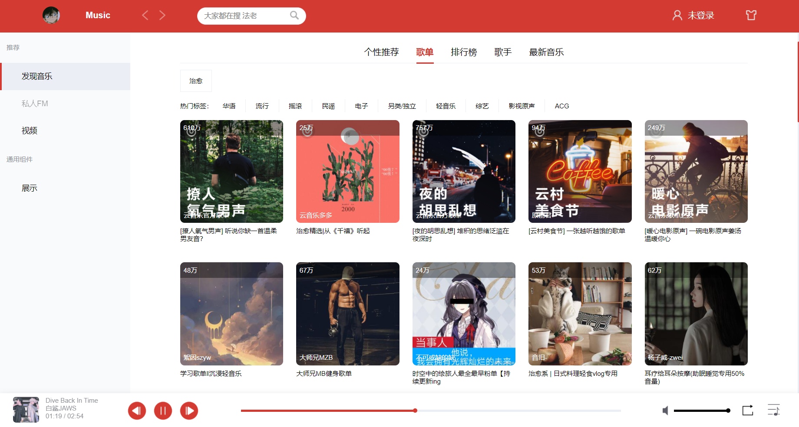
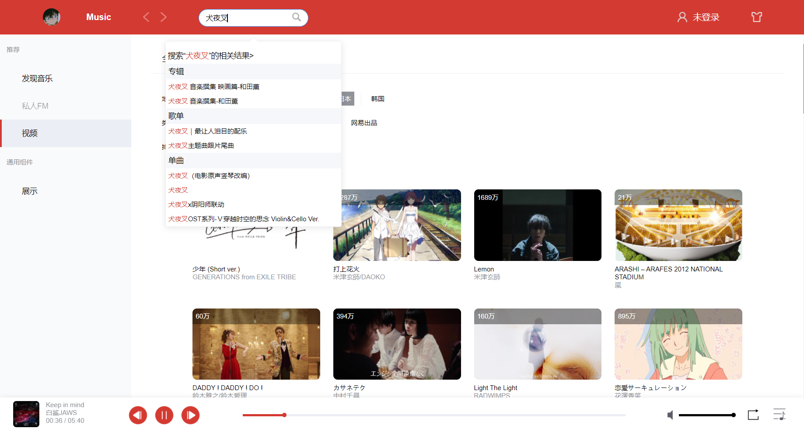

# 简介

该项目是我在刚工作那会用摸鱼时间做的一个小玩具😘，仿照 Windows 网易云客户端端的 UI 界面（做了一些小改动），使用 Vue2 全家桶进行实现，欢迎大佬们点 star ✨，有问题可以恰我 VX（13690896312）。

- [预览✨](https://music.zhangxc.cn/)
- [源码🎨](https://github.com/ZzZzzzxc/vue-netease-cloud-music)

# 技术栈

- 后端：使用的是开源项目 [Binaryify 大佬的网易云音乐 API](https://github.com/Binaryify/NeteaseCloudMusicApi)，我把项目拉下来部署到了自己的云服务器上。
- 前端：常规的 vue2 全家桶。

# 模块

```js
├─api 后台接口
├─assets 静态资源
├─base 基础 UI 组件
├─components 业务组件
├─config 业务配置
├─layout 页面基础布局
├─plugins 项目插件
├─router 路由
├─store 全局状态管理
├─style 样式
├─utils 工具方法
└─views 具体页面
```

# 已完成功能

- 个性推荐页
- 歌单
- 排行榜
- 歌手
- 最新音乐
- MV 列表页、播放页
- 音乐播放
- 音乐播放列表
- 搜索建议、搜索详情
- 账号密码登录










# 项目启动

```js
npm i
npm run dev
```